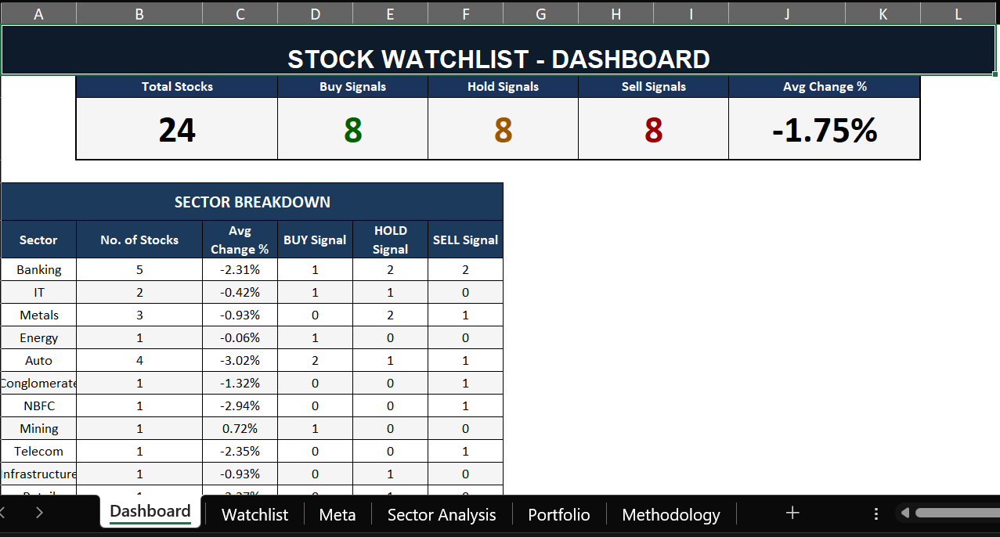
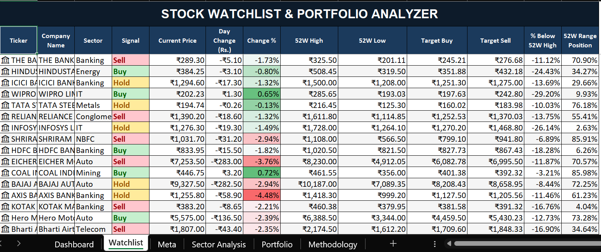
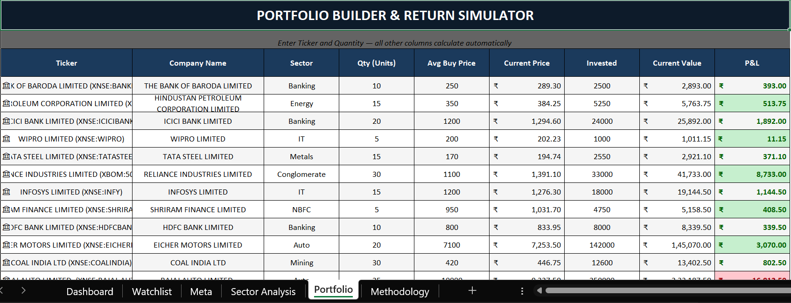
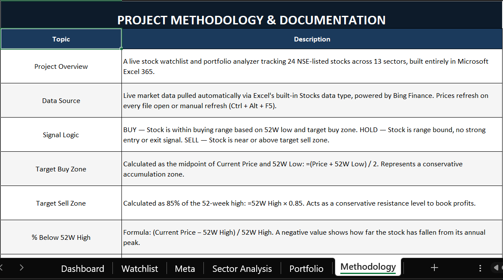

# stock-tracker-and-analyzer
Excel-based stock tracker and portfolio analyzer with watchlist management, sector analysis, and performance dashboard.

# Stock Watchlist & Portfolio Analyzer (Excel Project)

## Overview

This project is a Microsoft Excel based stock tracking and portfolio analysis tool designed to monitor watchlists, generate buy/hold/sell signals, and simulate portfolio performance using live market data.

The system tracks NSE listed companies across multiple sectors and automatically updates prices using Excel's built in Stocks data type.

---

## Key Features

• Live stock watchlist tracking  
• Automated Buy Hold Sell signal logic  
• Sector wise market analysis  
• Portfolio builder and return simulator  
• Dashboard summarizing stock signals and sector performance  
• Integration with Excel live market data  

---

## Dashboard

The dashboard summarizes the entire watchlist including total stocks tracked, buy hold sell signals and sector performance breakdown.

---

## Watchlist Analyzer

The watchlist sheet tracks key stock metrics including:

• Current price  
• Daily change  
• 52 week high and low  
• Target buy and sell levels  
• Distance from 52 week high  
• Automated signal generation

---

## Portfolio Builder & Return Simulator

Users can simulate a portfolio by entering ticker and quantity. The sheet automatically calculates:

• Investment value  
• Current portfolio value  
• Profit and loss  
• Portfolio exposure by sector

---

## Methodology

Signal logic is derived from price position relative to the 52 week range:

BUY – Stock trading near accumulation zone  
HOLD – Stock trading within neutral range  
SELL – Stock trading near resistance zone

Target zones are calculated using:

Target Buy = (Current Price + 52W Low) / 2  
Target Sell = 85% of 52 Week High

---

## Tools Used

Microsoft Excel  
Excel Stocks Data Type (Live Market Data)  
Financial Data Structuring  
Dashboard Design

---

## Skills Demonstrated

Financial data analysis  
Equity market tracking  
Portfolio performance monitoring  
Excel dashboard development  
Analytical modeling

---

## Author

Akashdeep Mukherjee  
Finance Student | M.Com Finance, Narsee Monjee College, Mumbai
